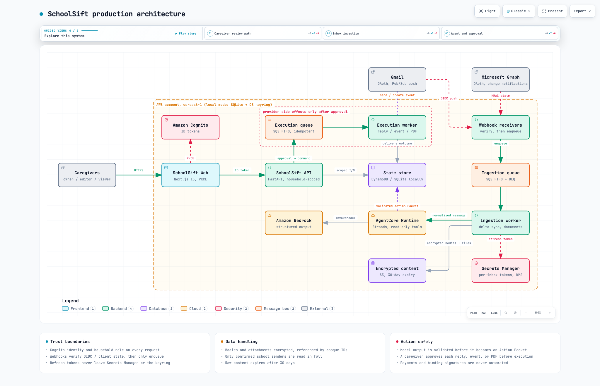

# SchoolSift

**Every school email, turned into the next right action.**

SchoolSift connects to the Gmail and Outlook inboxes a household uses for
school, reads only the senders you confirm, and turns each message into an
**Action Packet**: a short summary, which child and deadline it concerns,
the evidence behind every claim, and a small set of proposals you can edit,
approve, or reject. A draft reply. A calendar event. A filled-in PDF form.
Nothing leaves the household until an editor approves it, and payments or
legally binding signatures are never automated; they surface as escalations
for a person to handle.

This repository is the production codebase, built to run on AWS (Amazon
Bedrock AgentCore Runtime, DynamoDB, S3, SQS, Cognito) and to run locally
against an empty SQLite database with the same code paths. There is no
demo mode, no seeded inbox, and no fake provider result anywhere in the
runtime. Test fixtures live only under `backend/tests/` and `apps/web/tests/`.

> Status: tested end to end on a real Gmail inbox. A parent's account was
> connected through Google OAuth, 3,000 message headers synced, the school's
> senders trusted, and nine real school emails (with PDF letters) analysed by
> the Strands agent on Amazon Bedrock into Action Packets with draft replies,
> calendar proposals, and escalations. The AWS stack (KMS, S3, DynamoDB, SQS,
> Cognito, ECR, AgentCore runtime) is deployed; the API and workers still run
> locally against SQLite. See [What is not done](#what-is-not-done).

## Architecture



Interactive versions (pan, zoom, guided views, dark mode) and editable
sources are in [`docs/architecture/`](docs/architecture/README.md):

| Diagram | Interactive | Source |
|---|---|---|
| Production architecture | `system.html` | `system.architecture.json`, `system.excalidraw` |
| Email to approved action (sequence) | `message-to-action.html` | `message-to-action.sequence.json` |
| Action Packet lifecycle | `action-packet.html` | `action-packet.lifecycle.json` |

The system is a chain of narrow trust boundaries:

1. **Identity and household.** The web app signs in through Cognito (PKCE)
   and sends the ID token to the API. Every request resolves to a household
   membership with an `owner`, `editor`, or `viewer` role; every store read
   and write is scoped to that household. Locally, `SCHOOLSIFT_AUTH_MODE=local`
   uses one fixed caregiver so you can run without Cognito.
2. **Provider connections.** Each Gmail or Outlook inbox is its own
   connection with its own OAuth grant. Refresh tokens live in Secrets
   Manager (KMS-encrypted) or, locally, the OS keychain. They never appear
   in API responses, logs, or agent prompts.
3. **Notifications.** Gmail Pub/Sub push and Microsoft Graph change
   notifications hit `/v1/webhooks/{gmail,outlook}`. The handler verifies the
   Google OIDC token or the Graph client-state HMAC, deduplicates, enqueues a
   `mail_changed` event on an SQS FIFO queue, and returns. No sync and no
   model work happen in the request.
4. **Ingestion worker.** Runs Gmail history or Graph delta sync from the last
   checkpoint, falls back to a full resync when the cursor is expired, and
   imports bodies and attachments only for confirmed senders. Content is
   encrypted (S3 with a 30-day lifecycle, or Fernet files locally) and the
   database stores opaque references.
5. **Analysis.** The Strands agent on AgentCore Runtime receives a
   normalized message plus household-scoped, read-only tools (children,
   calendar, documents). Bedrock returns structured output; `proposal_policy`
   rejects anything that names an arbitrary recipient, an unknown document,
   a non-PDF form, an unknown or sensitive form field, or an invalid calendar
   window before the Action Packet is stored.
6. **Review.** Editors change a proposal by creating a new immutable version.
   Approval names the version and payload hash it reviewed; stale requests
   get `409`. Escalations (payment, signature, unknown sender) can never be
   approved.
7. **Execution.** Approval creates exactly one execution record and an outbox
   row. A worker claims it once, re-verifies the payload hash, refreshes the
   inbox's credentials, and performs the send or calendar insert with a
   deterministic idempotency key. Outcomes are explicit:
   `completed`, `failed` (manual review), or `delivery_uncertain` when the
   connection timed out or dropped after an irreversible call. Nothing is
   retried after that point; only failures before the call (a refused
   connection, a 5xx) go back to the queue, at most five times.

## Local development

Requires Node 24+, pnpm 10.14+, and [uv](https://docs.astral.sh/uv/)
(installs Python 3.12 and the Strands SDK).

```bash
pnpm install
uv sync

# terminal 1: API on http://127.0.0.1:8000 (creates .schoolsift/schoolsift.db)
uv run uvicorn schoolsift.api:create_app --factory --port 8000

# terminal 2: web on http://localhost:3210
pnpm --dir apps/web dev
```

The first run asks for a household and a child, then shows connection
setup. Connect buttons stay disabled until the provider OAuth variables in
[`.env.example`](.env.example) are set; with them set, **Connect** runs the
real authorization-code flow against Google or Microsoft with a one-time,
hashed, ten-minute state. **Sync inbox** lists headers and proposes senders;
mark a school sender trusted and sync again to import content. Processing
needs `SCHOOLSIFT_BEDROCK_MODEL_ID` and AWS credentials; without them the
message stays in "waiting for agent" rather than producing a fabricated
packet.

Local mode also exposes two routes the AWS deployment does not:
`POST /v1/executions/dispatch` moves approved executions from the outbox to
the local queue, and `POST /v1/executions/{id}/run` (body `{"confirm": true}`)
performs one of them against the real provider. The web app puts both behind
a checkbox that names the consequence, because they do send email.

### Verification

```bash
pnpm verify
```

Runs ESLint, Ruff (lint and format), TypeScript, strict mypy, Vitest,
pytest, the Next.js production build, Playwright (it starts both servers with
a temporary database), the CDK assertion tests, an offline `cdk synth`, and
`scripts/verify_no_secrets.py`. Individual steps: `pnpm lint`,
`pnpm typecheck`, `pnpm test`, `pnpm test:e2e`, `pnpm infra:test`,
`pnpm infra:synth`.

## Repository layout

```text
apps/web/                 Next.js 15 app (port 3210); Zod contracts in lib/contracts.ts
backend/src/schoolsift/
  api.py                  FastAPI app; create_app(settings, store, providers, vault, content, analyzer)
  identity.py             Cognito ID-token verification, local principal, membership roles
  config.py               Settings from env; aws mode fails closed on missing config
  models.py, domain.py    Persisted records; Action Packet contract and proposal state machine
  proposal_policy.py      Shared safety rules for model output and caregiver edits
  store.py, sqlite_store.py   Store protocol; SQLite with ordered migrations
  aws_state.py            DynamoDB repository primitives (conditional writes, claims)
  providers.py            Gmail and Graph OAuth, mail, calendar, and send adapters over httpx
  credentials.py, content.py  Keychain vault; Fernet content store
  aws_adapters.py         S3 content, Secrets Manager vault, SQS ingestion and execution queues
  sync.py, documents.py   Delta sync; bounded PDF/Office/text extraction (defusedxml, pypdf)
  webhooks.py             Gmail OIDC and Graph client-state validation, enqueue only
  subscription_service.py Gmail watch and Graph subscription creation and renewal
  agent.py, agent_data.py, processing.py   Strands agent seam, data resolution, packet persistence
  execution.py            Outbox, execution claims, provider execution, delivery outcomes
  workers.py              SQS handler factories (ingestion, renewal, execution) with FIFO partial-batch semantics
  agentcore_app.py        AgentCore Runtime entrypoint
backend/tests/            pytest suite with sanitized fixtures and httpx MockTransport
infra/                    AWS CDK stack (TypeScript) and assertion tests
docs/architecture/        Archify sources, interactive HTML, Excalidraw export
scripts/                  verify_no_secrets.py, archify_to_excalidraw.py
```

## Deploying to AWS

The stack in `infra/lib/schoolsift-stack.ts` is deployed to a real account
in `us-east-1` (base infrastructure plus the AgentCore runtime by direct
code deployment). It defines: a KMS key; the raw-content S3
bucket with 30-day expiry; the DynamoDB state table; ingestion and execution
SQS FIFO queues with dead-letter queues; the Cognito user pool and PKCE app
client; ECR repositories and log groups for the API and workers; an
EventBridge Scheduler group (schedules disabled until workers are deployed);
and the Bedrock AgentCore runtime resource.

Prerequisites you must provide outside this repository:

- A Google Cloud project with the Gmail API enabled, an OAuth client, a
  Pub/Sub topic that Gmail may publish to, and a push subscription that
  posts to `${SCHOOLSIFT_PUBLIC_API_URL}/v1/webhooks/gmail` with an OIDC
  token for `SCHOOLSIFT_GMAIL_PUSH_AUDIENCE` from
  `SCHOOLSIFT_GMAIL_PUSH_SERVICE_ACCOUNT`. Restricted Gmail scopes require
  Google's verification before non-test users can connect.
- A Microsoft Entra app registration with `Mail.Read`, `Mail.Send`, and
  `Calendars.ReadWrite` delegated permissions and the callback URL.
- Bedrock model access in `SCHOOLSIFT_AWS_REGION` for
  `SCHOOLSIFT_BEDROCK_MODEL_ID`. Use a cross-region inference profile id
  (for example `us.anthropic.claude-haiku-4-5-20251001-v1:0`); bare model
  ids are rejected for on-demand use. New accounts must also submit the
  one-time Anthropic use-case form (`aws bedrock put-use-case-for-model-access`).

Deploy in two steps from `infra/`:

```bash
npx cdk bootstrap aws://<account>/us-east-1
npx cdk deploy -c includeAgentRuntime=false -c cognitoDomainPrefix=schoolsift-<account>

bash ../scripts/build_agentcore_package.sh          # aarch64 zip in dist/
aws s3 cp ../dist/agentcore-package.zip s3://<bucket>/schoolsift/agentcore/package.zip
npx cdk deploy -c cognitoDomainPrefix=schoolsift-<account> \
  --parameters AgentCodeBucket=<bucket> \
  --parameters AgentCodePrefix=schoolsift/agentcore/package.zip \
  --parameters AgentCodeVersionId=<s3 version id>
``` `SCHOOLSIFT_ENVIRONMENT=aws` refuses to start unless Cognito,
Bedrock, the Gmail push settings, and an HTTPS public API URL are all
configured.

## Security boundaries

- Every store operation takes a household ID; a record from another
  household is treated as not found.
- OAuth state is 32 random bytes, stored only as a SHA-256 hash, single-use,
  bound to the household and provider, and expires after ten minutes.
- Refresh tokens, raw bodies, attachment bytes, and content references are
  excluded from all API responses.
- Email text and attachments are untrusted input to the model. The agent has
  read-only tools; any instruction found in a message is data, not a command.
- Replies may go only to the original sender or reply-to address. Calendar
  proposals must be timezone-aware and end after they start. PDF proposals
  must target a real PDF with known AcroForm fields and may not touch
  payment, banking, or signature fields.
- Approval binds to a proposal version and payload hash. Execution
  re-verifies the hash before contacting a provider.
- Webhook handlers never sync or invoke the model; they validate and enqueue.

## What is not done

- Live-tested so far: Gmail OAuth, header sync, content import, Bedrock
  analysis, approval. Not yet exercised against a real account: sending an
  approved reply, creating a calendar event, Microsoft Graph, Cognito sign-in,
  and invoking the deployed AgentCore runtime (it needs a Cognito token and an
  AWS-backed data source). Those adapters are tested against recorded request
  shapes with `httpx.MockTransport`.
- The DynamoDB-backed `SchoolSiftStore` is not wired; SQLite is the active
  store in both modes today, so the API and workers run locally.
- API and worker container images are not built or published; the ECR
  repositories and log groups exist in the stack for them.
- EventBridge schedules for subscription renewal and content retention are
  defined but disabled.
- Household invitations issue a one-time token shown in the UI; no email is
  sent.
- Google restricted-scope verification and Microsoft publisher verification
  have not been started.

## Read more

The build story, including what a real inbox taught us, is on AWS Builder
Center: [Agents for Humans: building SchoolSift](https://builder.aws.com/content/3JJrjwp1ua3qPA6TGCBDgLQi4S3/agents-for-humans-building-schoolsift-an-agent-that-reads-school-letters-so-parents-dont-miss-the-deadline).

## License

MIT. See [`LICENSE`](LICENSE).
